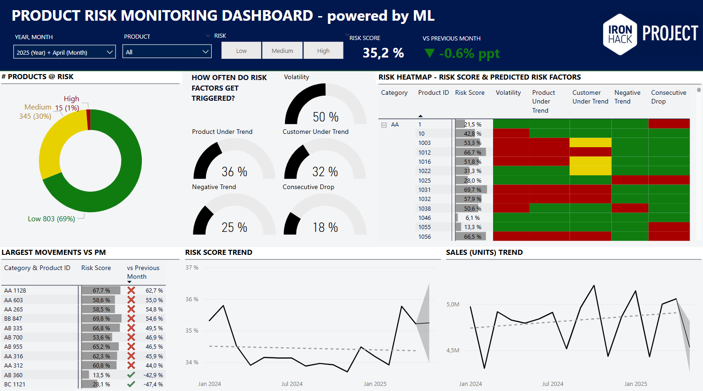

# Early Warning System for Product Sales

This project uses machine learning to detect early signs of sales decline in medical products using transaction data and behavioral features.

## Features
- Trend and volatility detection
- Feature engineering with calendarization
- XGBoost classifier with SMOTE for imbalanced learning
- Risk score generation and Power BI visualization

## Project Structure
- `notebooks/`: Jupyter notebooks for EDA and model training
- `outputs/`: Charts and saved models
- `powerbi/`: Power BI dashboards

## Setup
```bash
pip install -r requirements.txt


